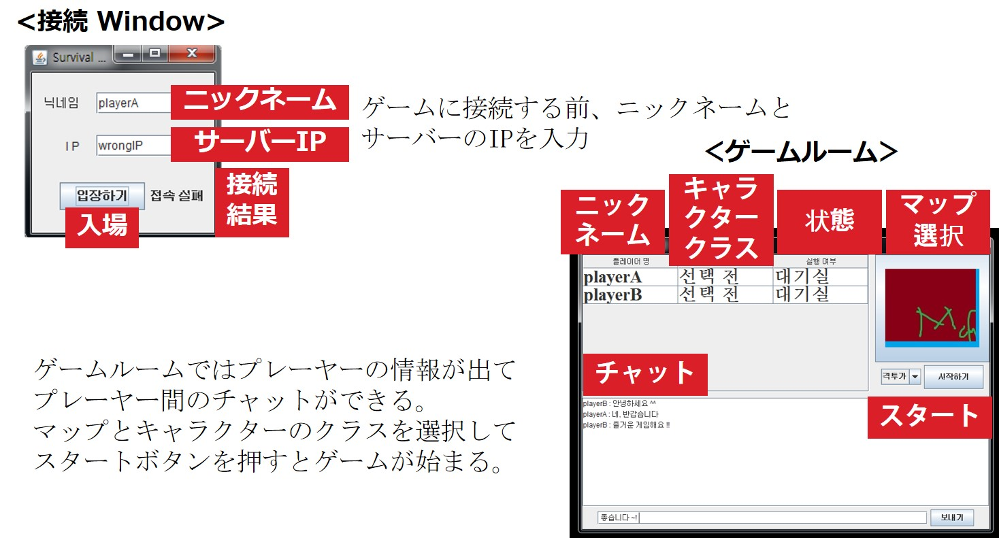
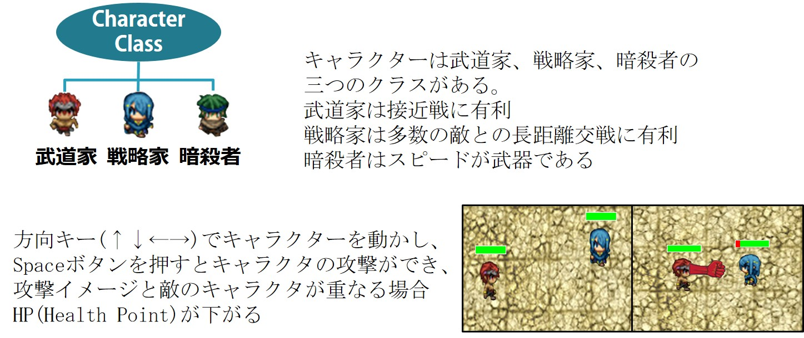

プロジェクト名｜
Dungeon Survival

開発期間 / 開発人員｜
2016. 5. 14 ~ 2016. 6. 19( 1ヶ月 )
 　/　 1人

開発環境｜
Java( IOStream, Socket, Swing ) * IOStream : Input / Output Stream

概要｜

- 多数のプレーヤーとの戦闘、生き残りをかけたオンライン激闘
　サバイバルゲーム
- ３つのキャラクターのクラス（ファイター、戦略家、アサシン）を
選択し、それなりの特性を活用して最後まで生存することが目標

機能説明

